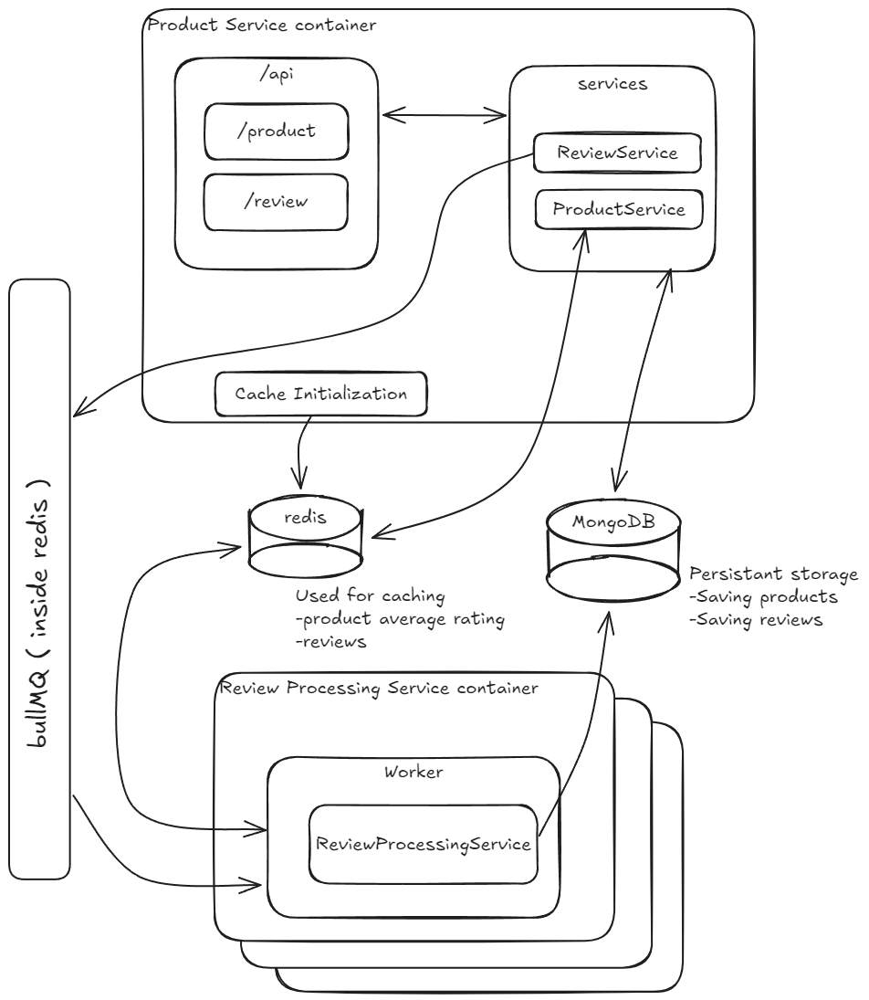

# product-process-example

## Project Architecture

This project has 3 packages `product-service`, `review-service` and `shared`.

- **product-service**: This package has the endpoints for the product and review entities. Inside this service we also initialize the products in the cache
- **review-service**: Has the worker that will retrieve jobs from the queue (review processing)
- **shared**: Common schemas/client that will be used by the other 2 services. These will be loaded into the other packages and installed in the docker.

In short here's a picture with how the system is setup:

In terms of infra we have a redis server (that contains a queue, using bullMQ) a MongoDB server, a product-service and a review-service (that can be scaled, by default in the docker-compose I set up 2 instances).

The caching process for products is done at app start. In this method we just cache all the products (together with their averageRating).

The process for the reviews is done "Lazy", whenever we check all the reviews for a product or when we do an action on a review, if by chance that product still has no reviews we populate it, if the product has reviews cached we then just update the cache instead.
By doing this we might be taking some time on retrieving reviews at start, but as the caching is done it will be faster.

We expose the `product` and `review` APIs from the product-service. At `product-service` start we initialize the product cache in the redis server.
- ReviewService: Apart from the basic CRUD, this service will setup "jobs" in the bullMQ so that the Review Processing Service can take them
- ProductService: CRUD operations on product service, will also load/update the reviews into the cache whenever needed

In the `review-service`
- ReviewProcessingService: The calculation part of the reviews is done within this class
- `review.worker.ts`: In this file we define the worker logic, this will be instantiated when starting up this app

## Trade-offs

The cache system starts only with the products, so it's faster to initialize and so we don't flood the cache from the start.

If a cached product exists we show that version, if there's intensive I/O in reviews we might present some outdated info before the review is processed but at least the user won't be stuck looking at a loading screen, eventually the review will be updated!

In terms of storage, the reference is stored on the review part leaving the product schema clean. This was done because if we had a thousand reviews and we stored the reference to those in the product object then it might become too heavy.

## Possible improvements that were skipped

In terms of things that could be added, logging feature, load balancing for the workers/review-service

Implementing a page/limit system for the reviews would also be ideal (with the current cached reviews and the DB reviews for example, at the moments it's just done for the list of products, so whenever you call for the list of reviews for a product you get all of the reviews!

# Tools used

`MongoDB` for the DB  with `mongoose` for better schema definition, there's a `mongo-express` setup in the docker setup for easy viewing of the db. We use `redis` (through ioredis) as the cache and the `bullMQ` for the queue system. 

`Node.js` and `express` for the services together with `Typescript`

# API

All the endpoints have validation through `express-validator` library, all defined in the `product-service/src/validations`

**endpoint**: `/api`

---
### Product

**endpoint**: `/api/product`

#### List Products
- **GET** `/`
- Accepts `page` and `limit` params
- Retrieves the full list of products

#### Get Product by Id
- **GET** `/:id`
- Retrieves a specific product by its ID

#### List Reviews for a Product
- **GET** `/reviews/:id`
- Retrieves all reviews for a specific product

#### Create Product
- **POST** `/`
- Creates a new product

#### Update Product
- **PUT** `/:id`
- Updates an existing product

#### Delete Product
- **DELETE** `/:id`
- Deletes a product by its ID
---
### Review

**endpoint**: `/api/review`

#### Get a Review by Id
- **GET** `/:id`
- Retrieves a specific review by its ID.

#### Create a Review
- **POST** `/`
- Creates a new review.

#### Update a Review
- **PUT** `/:id`
- Updates an existing review.

#### Delete a Review
- **DELETE** `/:id`
- Deletes a specific review by its ID.
